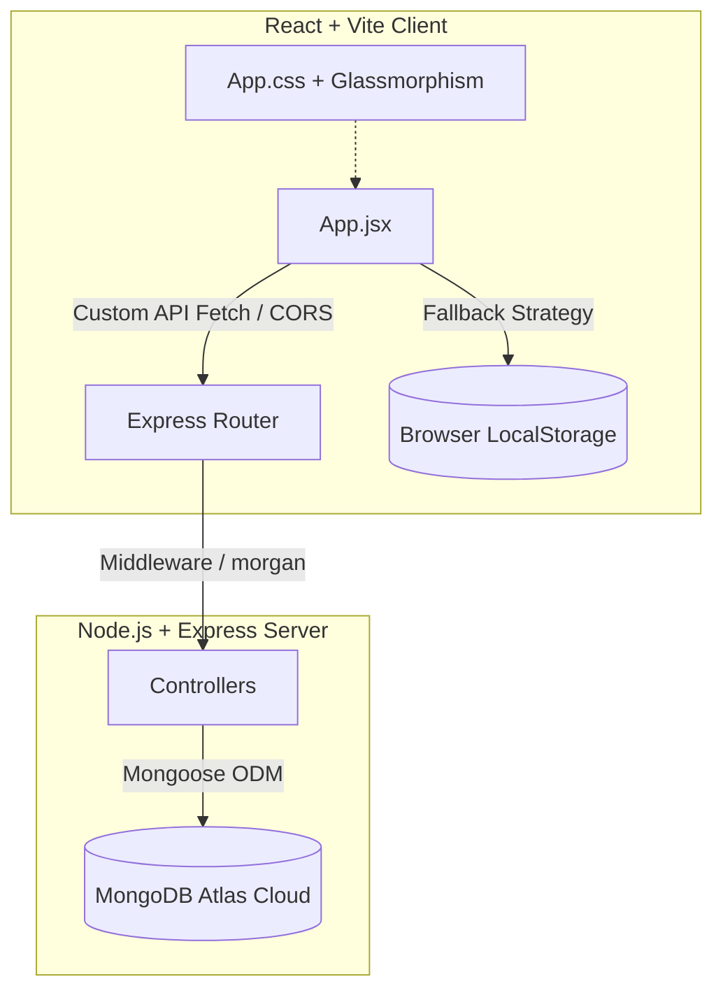

# ⚡ MITTR TaskSphere — Premium MERN Stack Boilerplate

Welcome to **MITTR TaskSphere**, a production-grade, state-of-the-art MERN (MongoDB, Express, React, Node.js) workspace designed with maximum aesthetic polish, high performance, and an intuitive developer experience.

This project splits **Frontend** and **Backend** into clean, modular directory structures, allowing isolated scaling, easy deployment, and clear separation of concerns.

---

## 🏗️ Project Architecture



---

## 🌟 Key Features

1. **Elegant Glassmorphic UI**: Premium theme with deep obsidian gradients, neon accents, glowing status pulsators, and fluid micro-animations.
2. **Double-Engine Synchronizer**: Complete CRUD interface synced to MongoDB Atlas. If Atlas is offline or not yet configured, the system automatically hot-swaps to **Local Storage Fallback Mode**, ensuring 100% operational safety and zero blank screens.
3. **Database Health Dashboard**: Real-time server-side status checks shown directly in a floating branding header.
4. **Task Control Workspace**: Complete task management with title, descriptions, due dates, multi-stage statuses (`pending`, `in-progress`, `completed`), and dynamic color priority tags.
5. **Advanced Filtration & Search**: Instantly query your workspace by string search, priority, or completion status with responsive UI skeletons.
6. **Unified Developer Pipeline**: Concurrently run, install, and update both frontend and backend directories with single command scripts.

---

## 🚀 Quick Start Guide

Follow these simple steps to run the complete environment:

### Step 1: Clone & Install Dependencies
Run this in the root project directory to install all packages for the root runner, backend server, and frontend dashboard:
```bash
npm run install-all
```

### Step 2: Configure MongoDB Atlas (Database)
1. Go to the `backend` folder and create a `.env` file (copied from `.env.example`):
   ```bash
   cp backend/.env.example backend/.env
   ```
2. Open `backend/.env` and replace `MONGODB_URI` with your connection string from MongoDB Atlas:
   ```env
   PORT=5000
   MONGODB_URI=mongodb+srv://<username>:<password>@<cluster>.mongodb.net/taskdb?retryWrites=true&w=majority
   NODE_ENV=development
   ```

### Step 3: Run the Development Servers
In the project root directory, run:
```bash
npm run dev
```
*This command uses `concurrently` to spin up both servers:*
* 💻 **Frontend Client:** `http://localhost:5173` (Vite dev server)
* ⚙️ **Backend Express API:** `http://localhost:5000` (Node server with Nodemon auto-reload)

---

## 📁 Workspace Folder Structure

```text
ca-mittr/
├── backend/                  # Node.js + Express API Server
│   ├── config/               # Database Connection configuration
│   │   └── db.js
│   ├── controllers/          # Business logic handlers for MERN CRUD
│   │   └── taskController.js
│   ├── models/               # Mongoose schemas (Task models)
│   │   └── Task.js
│   ├── routes/               # Express routing endpoints
│   │   └── taskRoutes.js
│   ├── .env                  # Port, MongoDB connection strings (Private)
│   ├── .env.example          # Public environment variables blueprint
│   ├── package.json          # Server package specifications
│   └── server.js             # Main server entrypoint
│
├── frontend/                 # React + Vite Client Application
│   ├── src/
│   │   ├── App.jsx           # Core dashboard logic & CRUD hooks
│   │   ├── App.css           # Premium glassmorphism design layouts
│   │   ├── index.css         # Typography resets and modern colors
│   │   └── main.jsx          # Entry point
│   ├── index.html            # Webpage frame
│   ├── package.json          # Frontend packages (React 19, Vite 8)
│   └── vite.config.js        # React plugin and server configs
│
├── package.json              # Workspace-wide control script
└── README.md                 # Main Documentation file
```

---

## ⚡ Available Commands

| Command | Action | Location |
| :--- | :--- | :--- |
| `npm run install-all` | Installs dependencies for root, backend, and frontend | Root |
| `npm run dev` | Runs both React frontend and Node backend concurrently with hot-reloading | Root |
| `npm run backend` | Runs only the Node.js Express server | Root |
| `npm run frontend` | Runs only the React Client development server | Root |
| `npm run dev` | Runs standard Nodemon backend server | `backend` |
| `npm run dev` | Runs Vite frontend client | `frontend` |

---

## 🛡️ License

MIT License. Designed with 💜 by **MITTR Tech Corp**.
